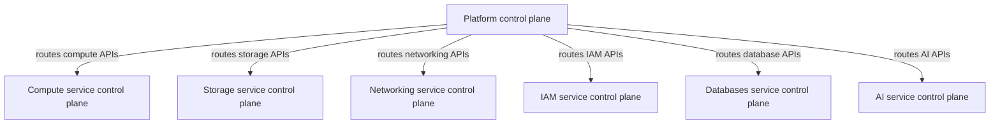

# IDP on Upbound Reference Platform

This repository contains a reference platform for an Internal Developer Platform on [Upbound](https://www.upbound.io/product/upbound), powered by [Crossplane](https://crossplane.io).

> [!IMPORTANT]
> This platform uses _control plane topologies_, a [private preview feature set](https://docs.upbound.io/deploy/control-plane-topologies/) available only on Upbound. You can't deploy your own instance of this repository's contents unless you have these features enabled.


## Overview

This platform defines a set of APIs for a variety of cloud resources app developers might use as part of their day-to-day work. For ease of navigability, this reference architecture is defined as a monorepo, composed of several [control plane projects](https://docs.upbound.io/learn/core-concepts/projects/):

* [compute](source/controlplanes/compute/) is a control plane project that defines the following APIs:
  * [Application](source/controlplanes/compute/apis/applications/definition.yaml) lets a developer deploy a basic containerized app onto a Kubernetes cluster.
  * [Cluster](source/controlplanes/compute/apis/clusters/definition.yaml) lets a developer spin up a new Kubernetes Cluster with its own service account inside a Network.
  * [Function](source/controlplanes/compute/apis/functions/definition.yaml) lets a developer deploy a serverless function. 
  * [VirtualMachine](source/controlplanes/compute/apis/virtualmachines/definition.yaml) lets a developer deploy a Virtual Machine.
* [networking](source/controlplanes/networking/) is a control plane project that defines the following APIs:
  * [Network](source/controlplanes/networking/apis/networks/definition.yaml) lets a developer deploy a new VPC.
  * [Subnet](source/controlplanes/networking/apis/subnets/definition.yaml) lets a developer deploy a subnet in a VPC.
* [iam](source/controlplanes/iam/) is a control plane project that defines the following APIs:
  * [Account](source/controlplanes/iam/apis/accounts/definition.yaml) lets a developer deploy a new Cloud account.
  * [ServiceAccount](source/controlplanes/iam/apis/serviceaccounts/definition.yaml) lets a developer deploy a Service Account.
* [db](source/controlplanes/db/) is a control plane project that defines the following APIs:
  * [SQLInstance](source/controlplanes/db/apis/sqlinstances/definition.yaml) lets a developer deploy a SQL Instance into a VPC subnet.
* [storage](source/controlplanes/storage/) is a control plane project that defines the following APIs:
  * [bucket](source/controlplanes/storage/apis/buckets/definition.yaml) lets a developer deploy a basic bucket.
* [ai](source/controlplanes/ai/) is a control plane project that defines the following APIs:
  * [Model](source/controlplanes/ai/apis/models/definition.yaml) lets a developer deploy an AI Model to a Kubernetes cluster.

The composite types outlined above are meant to illustrate how to use the [control plane topology](https://docs.upbound.io/deploy/control-plane-topologies/) features. These composites don't compose real cloud resources, instead they use:

* [_NopResources_](https://github.com/crossplane-contrib/provider-nop), a mock resource type that mimics deploying real cloud resources.
* [_ReferencedObjects_](https://docs.upbound.io/deploy/control-plane-topologies/#compose-a-_referencedobject_), an Upbound-only resource type that lets you reference, observe, and potentially create resources defined by APIs offered by other **service-level control planes** powering your platform.

> [!TIP]
> For ease of navigability, this reference architecture is defined as a monorepo. You don't have to do it this way and have flexibility to define each part in its own repo if you wish.

## Architecture

This platform defines a two-tier topology of control planes that work together to provide a unified experience for platform consumers:



* **platform control planes:** There's only one platform control plane deployed in this reference architecture. You can find it's definition in the [platform](platform/) folder. All API requests made by consumers flows through this control plane to lower-level control planes.
* **service-level control planes:** Individual platform teams own service-level control planes. They define a part of the total APIs offered on the platform. The platform control plane routes all requests to service-level control planes. They're called _service-level_ control planes because they're responsible for providing composite API types that deliver a managed service experiences in the form of `${resource}-as-a-service`. This reference architecture deploys a control plane on a domain boundary:
  * [compute](source/controlplanes/compute/examples/ctp.yaml)
  * [networking](source/controlplanes/networking/examples/ctp.yaml)
  * [iam](source/controlplanes/iam/examples/ctp.yaml)
  * [db](source/controlplanes/db/examples/ctp.yaml)
  * [storage](source/controlplanes/storage/examples/ctp.yaml)
  * [ai](source/controlplanes/ai/examples/ctp.yaml)

Each link above is to the definition of the control plane resource deployed with the corresponding project it's defined next to. 

The single **platform control plane** is defined [here](source/controlplanes/platform/examples/ctp.yaml). It doesn't define any of its own APIs. Instead, each API set defined by each service-level control plane gets deployed to the platform control plane as [RemoteConfigurations](https://docs.upbound.io/deploy/control-plane-topologies/#install-a-_remoteconfiguration_). This list of API dependencies is defined [here](source/controlplanes/platform/examples/remote-configs.yaml).

Once all control planes get deployed, create an [Environment](https://docs.upbound.io/deploy/control-plane-topologies/#use-an-_environment_-to-route-resources) to configure how resources get routed to service-level control planes. This reference architecture employs a [basic routing scheme](source/controlplanes/platform/examples/environment.yaml) to map API groups to their corresponding service-level control planes 1:1.

## Quickstart

### Prerequisites

Before you can deploy the reference platform you should install the `up` CLI.

To install `up` run this install script:

```console
curl -sL https://cli.upbound.io | sh
```

See [up docs](https://docs.upbound.io/cli/) for more install options.

To install `crossplane` CLI follow https://docs.crossplane.io/latest/cli/#installing-the-cli

### Deploy the infrastructure

Clone this repository to your machine and change your current directory to its root. Then, log on to Upbound:

```console
up login
```

Connect to a Cloud Space in Upbound where the _Topologies_ private preview feature is enabled:

```console
up ctx upbound/upbound-gcp-us-central-1-preview/default
```

Deploy each service-level control plane. A sample resource configuration is linked in the previous section:

```console
kubectl apply -f source/controlplanes/compute/examples/ctp.yaml \
  -f source/controlplanes/storage/examples/ctp.yaml \
  -f source/controlplanes/networking/examples/ctp.yaml \
  -f source/controlplanes/iam/examples/ctp.yaml \
  -f source/controlplanes/db/examples/ctp.yaml \
  -f source/controlplanes/ai/examples/ctp.yaml
```

Once each control plane becomes healthy, connect to it and install the corresponding configuration built from its control plane project:

```console
up ctx ./compute
crossplane xpkg install configuration xpkg.upbound.io/upbound/idp-compute:v0.0.0-1741555865

up ctx ../storage
crossplane xpkg install configuration xpkg.upbound.io/upbound/idp-storage:v0.0.0-1741489092

up ctx ../networking
crossplane xpkg install configuration xpkg.upbound.io/upbound/idp-networking:v0.0.0-1741442021

up ctx ../db
crossplane xpkg install configuration xpkg.upbound.io/upbound/idp-db:v0.0.0-1741552381

up ctx ../iam
crossplane xpkg install configuration xpkg.upbound.io/upbound/idp-iam:v0.0.0-1741553829

up ctx ../ai
crossplane xpkg install configuration xpkg.upbound.io/upbound/idp-ai:v0.0.0-1741550279
```

Deploy the platform control plane:

```console
up ctx ..
kubectl apply -f source/controlplanes/platform/examples/ctp.yaml
```

Configure the platform control plane with Remote Configurations and routing:

```
up ctx ./portal
kubectl apply -f source/controlplanes/platform/examples/remote-configs.yaml \
  -f environment.yaml
```

### Deploy example resources

Each control plane project contains example manifests for resource claims. Deploy these to the platform control plane (portal) and watch how they get routed and created on lower-level control planes.

## Exploring API relationships

This reference architecture demonstrates some ways you can use _Topology_ features to compartmentalize your platform and build powerful composite APIs.

### Generic composite API

Starting with the basics, the first composite API type demonstrated on this platform is a self-contained API like [_VirtualMachine_](source/controlplanes/compute/apis/virtualmachines/definition.yaml). This API doesn't depend on other composite types defined and reconciled by other service control planes. It's solely responsible for composing a set of resources that are self-contained within the control plane. This method is the canonical method taught in OSS Crossplane for defining a new composite type.

### Reference another composite API

The [_Application_](source/controlplanes/compute/apis/applications/definition.yaml) composite type demonstrates how to use _ReferencedObjects_ to resolve a reference to another composite API. The _Application_ resource is a simplified representation of a containerized deployment to a Kubernetes cluster. In its API schema, you can see it requires a reference to a Kubernetes cluster at `.spec.parameters.application.clusterRef`.

In the _ApplicationClaim_ [example](source/controlplanes/compute/examples/application/example.yaml), the manifest demonstrates providing a reference to a _ClusterClaim_ resource with the name "example":

```yaml
apiVersion: compute.idp.upbound.io/v1alpha1
kind: ApplicationClaim
metadata:
  name: example
spec:
  parameters:
    application:
      name: guestbook-ui
      image: gcr.io/heptio-images/ks-guestbook-demo:0.2
      clusterRef:
        apiVersion: compute.idp.upbound.io/v1alpha1
        grants:
        - "Observe"
        kind: ClusterClaim
        name: example
        namespace: default
```

The `grants` field under the `clusterRef` means the creator of this _ApplicationClaim_ grants permission for the service control plane to resolve and observe the referenced cluster. The _Application_ composite API needs this permission because it needs to know which Kubernetes cluster to go create objects to deploy the workload into. You can see how this works in the composition:

```python
_items = [nopv1alpha1.NopResource {
    metadata: _metadata('application')
    spec.forProvider = {
        fields: parameters
        fields.deployedOnto = _ocds["cluster-ref"]?.Resource?.status?.atProvider?.manifest?.metadata?.uid or "None"
        conditionAfter = [{
            time: "5s"
            conditionStatus: "True"
            conditionType: "Ready"
        }]
    }
}]

_clusterRef = upboundv1alpha1.ReferencedObject {
    metadata: _metadata("cluster-ref")
    spec = {
        managementPolicies = [
            "Observe"
        ]
        deletionPolicy: "Orphan"
        composite = {
            apiVersion: "compute.idp.upbound.io/v1alpha1"
            jsonPath: ".spec.parameters.application.clusterRef"
            kind: "Application"
            name: oxr.metadata.name
        }
    }
}
```

The `cluster-ref` that gets created is a _ReferencedObject_, bringing it into the frame of the composition function execution pipeline. Once it's an observed composed resource, it's used to configure a field on the _NopResource_, which is meant to mimic a containerized deployment onto a Kubernetes cluster.

### Reference and create another composite API

The [_Cluster_](source/controlplanes/compute/apis/clusters/definition.yaml) composite type demonstrates how to use _ReferencedObjects_ to resolve a reference to another composite API **and create it, if it doesn't exist**. The _Cluster_ resource is a simplified representation of a Kubernetes cluster. In its API schema, you can see it requires a reference to a service account at `.spec.parameters.serviceAccountRef`.

In the _ClusterClaim_ [example](source/controlplanes/compute/examples/cluster/example.yaml), the manifest demonstrates providing a reference to a _ServiceAccountClaim_ resource with the name "cluster-sa":

```yaml
apiVersion: compute.idp.upbound.io/v1alpha1
kind: ClusterClaim
metadata:
  name: example
spec: 
  parameters:
    nodes: 2
    sku: "d2sv3"
    networkRef:
      apiVersion: networking.idp.upbound.io/v1alpha1
      grants:
        - Observe
      kind: NetworkClaim
      name: example # This references the NetworkClaim/example in the other project in this monorepo
    serviceAccountRef:
      apiVersion: iam.idp.upbound.io/v1alpha1
      grants:
        - "*"
      kind: ServiceAccountClaim
      name: cluster-sa # This creates the service account, if it doesn't exist
```

The `grants` field under the `serviceAccountRef` means the creator of this _ClusterClaim_ grants permission for the service control plane to resolve, observe the referenced service account, and create it if it doesn't yet exist. Try it out -- apply the example _ClusterClaim_ without the referenced _ServiceAccountClaim_ existing and observe how one gets created. But importantly, the _ServiceAccount_ doesn't get created in the compute control plane, it gets created in the IAM control plane. You can see how this works in the composition:

```python
_saRef = upboundv1alpha1.ReferencedObject {
    metadata: _metadata("sa-ref")
    spec = {
        managementPolicies = [
            "*"
        ]
        deletionPolicy: "Delete"
        composite = {
            apiVersion: "compute.idp.upbound.io/v1alpha1"
            jsonPath: ".spec.parameters.serviceAccountRef"
            kind: "Cluster"
            name: oxr.metadata.name
        }
        forProvider.manifest = iamv1alpha1.ServiceAccountClaim {
            metadata.name = parameters.serviceAccountRef.name
            spec.parameters = {
                billingAccount: "123456"
            }
        }
    }
}
```

There's two things that happen in the _ReferencedObject_ that gets composed above:

1. The _ReferencedObject_ being composed has a `managementPolicy` of `*`, giving it permission for the resource to get created.
2. The _ReferencedObject_ `spec` includes a `forProvider.manifest`, which gets used during the create request to supply the parameters for the new resource to get created. In this case, it's a new _ServiceAccountClaim_ to pair with the creation of the Kubernetes cluster.

### Reference and create another resource

A variation of the above, the [_SQLInstance_](source/controlplanes/db/apis/sqlinstances/definition.yaml) composite type demonstrates how to use _ReferencedObjects_ to create a new Kubernetes secret alongside the _SQLInstance_, in the same control plane where the resources representing the database get composed. You can see how this works in the composition:

```python
_secret = upboundv1alpha1.ReferencedObject {
    metadata: _metadata("sql-instance-secret-obj")
    spec = {
        managementPolicies = [
            "*"
        ]
        deletionPolicy: "Delete"
        ownerPolicy: "OnCreate"
        composite = {
            apiVersion: "db.idp.upbound.io/v1alpha1"
            jsonPath: ".spec.parameters.password.passwordSecretRef"
            kind: "SQLInstance"
            name: oxr.metadata.name
        }
        forProvider.manifest = {
            kind: "Secret"
            apiVersion: "v1"
            metadata.name: parameters.password.passwordSecretRef.name
            metadata.namespace: "default"
            stringData = {
                password: "booyah"
            }
        }
    }
}
```

As in the earlier section, this composition step includes a similar `forProvider.manifest` config to create the _Secret_. The difference is: this isn't creating a separate composite type on another control plane, it's creating another local resource in the same control plane.

## Routing setup

We explained earlier how the platform control plane is the front door to the platform. All composite API requests are submitted to the platform control plane first, then get routed down to the appropriate service control plane. The routing configuration is defined in an _Environment_ resource type. This reference architecture uses a basic [configuration](source/controlplanes/platform/examples/environment.yaml):

```yaml
apiVersion: scheduling.upbound.io/v1alpha1
kind: Environment
metadata:
  name: default
  namespace: default
spec:
  resourceGroups:
    - name: db.idp.upbound.io
      dimensions:
        offering: db
    - name: networking.idp.upbound.io
      dimensions:
        offering: networking
    - name: compute.idp.upbound.io
      dimensions:
        offering: compute
    - name: storage.idp.upbound.io
      dimensions:
        offering: storage
    - name: ai.idp.upbound.io
      dimensions:
        offering: ai
    - name: iam.idp.upbound.io
      dimensions:
        offering: iam
```

_Environment_ is a namespace-scoped resource, so you can assign tenants of your platform to designated namespaces in the platform control plane. This lets you have tailored routing rules on a per-tenant / per-namespace basis, if desired. In the configuration for this reference architecture, there' a single _Environment_ defined for the `default` namespace in the platform control plane.

For each resource API group offered in the platform control plane, it routes to the responsible service control plane. The format of the `spec.resourceGroups[*].name` matches that defined in a composite's `apiVersion` API group.

_Environments_ rely on _dimensions_ being set on underlying control planes. These are applied as lables and can be found in each service control plane's config linked at the top of this document.

## Questions?

For any questions, thoughts and comments don't hesitate to [reach
out](https://www.upbound.io/contact) or drop by
[slack.crossplane.io](https://slack.crossplane.io), and say hi.
